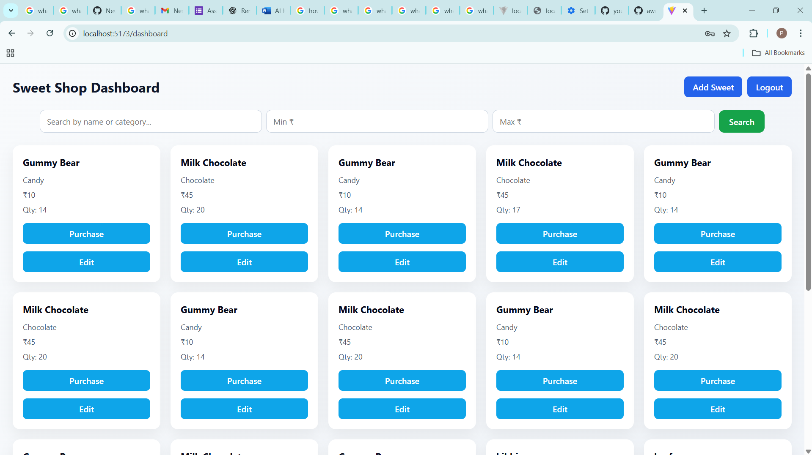
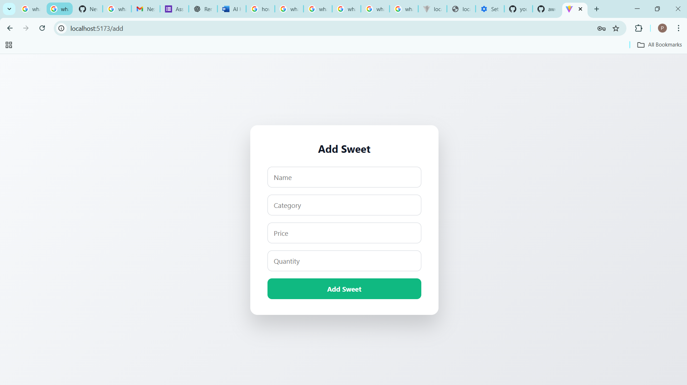
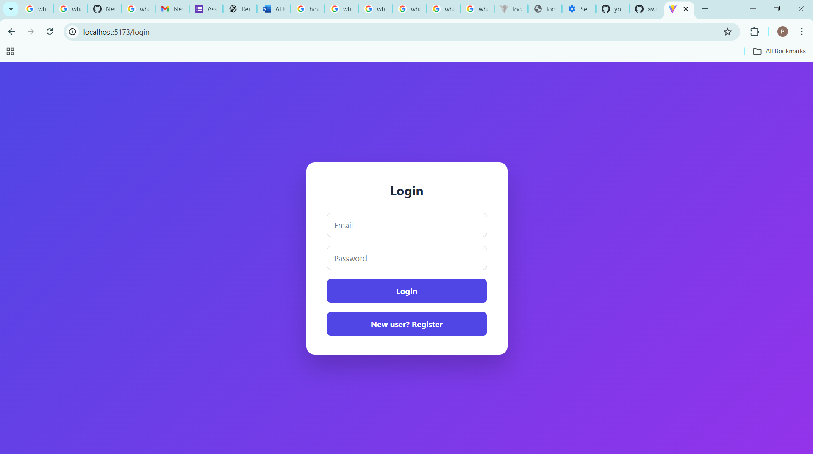
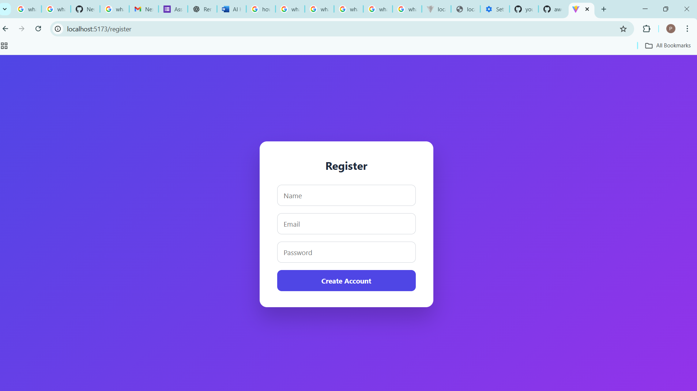
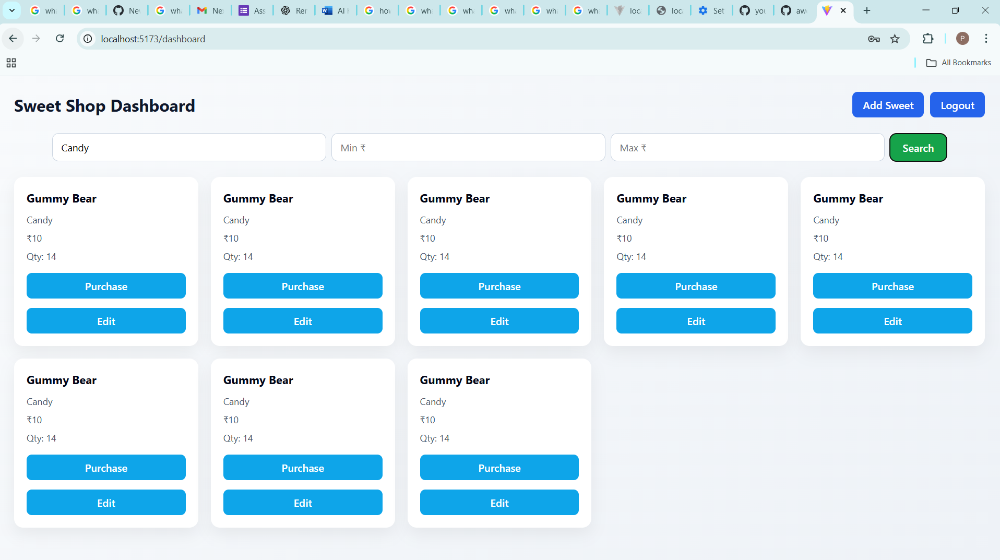
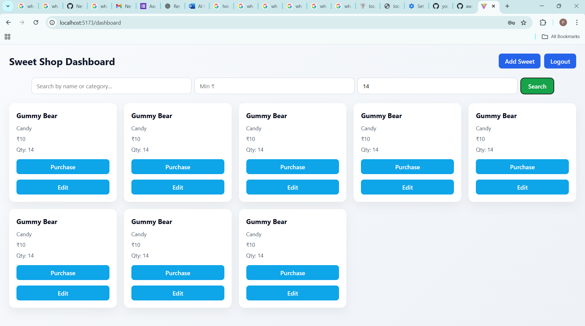
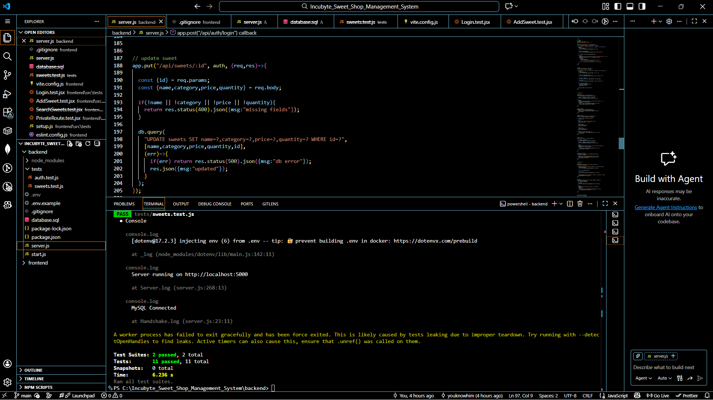

🍬🍭 SWEET SHOP MANAGEMENT SYSTEM
📸📸 APPLICATION SCREENSHOTS

Below are screenshots of the **final working application**, including UI, features, and test execution.

---

### 📊 Dashboard

---

### ➕ Add Sweet (Admin Feature)

---

### 🔐 Login Page

---

### 📝 Register Page

---

### 🔍 Search & Price Filter

---

### 🧪 Backend Test Results

---

### 🧪 Frontend Test Results

🧠 PROJECT OVERVIEW

The Sweet Shop Management System is a full-stack web application developed as part of the
Incubyte Kata Task.

The system allows:

Users to browse, search, and purchase sweets

Admins to manage inventory, pricing, stock, and availability

The project focuses on:

Clean backend API design

Secure authentication and authorization

Role-based access control

Automated testing for both backend and frontend

✨ CORE FEATURES
🔐 Authentication & Authorization

User registration and login

JWT-based authentication

Role-based access control (Admin / User)

🍭 Sweet Inventory Management

View available sweets

Purchase sweets with automatic quantity updates

Admin-only operations:

Add sweets

Edit sweets

Restock sweets

Delete sweets

🔍 Search & Filtering

Search sweets by name or category

Filter sweets by price range

Combined search and price filtering

🧪 Automated Testing

Backend API tests

Frontend component and route tests

🛠️ TECHNOLOGY STACK
🖥️ Frontend

React

Vite

CSS

⚙️ Backend

Node.js

Express.js

MySQL

JWT Authentication

🧪 Testing

Jest

Supertest

Vitest

React Testing Library

⚙️ LOCAL SETUP INSTRUCTIONS
🔹 Backend Setup

Navigate to the backend folder

Install dependencies

Create a .env file using .env.example

Configure database and JWT details

Start the backend server

The backend runs on http://localhost:5000

🔹 Frontend Setup

Navigate to the frontend folder

Install dependencies

Start the development server

The frontend runs on http://localhost:5173

🧪 TEST REPORT
✅ Backend Tests

Written using Jest and Supertest

Covers authentication, sweets APIs, and authorization logic

✅ Frontend Tests

Written using Vitest and React Testing Library

Covers login, register, dashboard, protected routes, and admin routes

All tests pass successfully, as shown in the screenshots above.

🤖 MY AI USAGE (MANDATORY DISCLOSURE)

AI tools (ChatGPT) were used responsibly and transparently during the development of this project.

How AI was used:

Generating backend and frontend test code, as automated testing was new to me

Understanding testing patterns, assertions, and mocking strategies

Assisting with debugging and resolving errors

Helping with SQL query design and search/filter logic

Improving code structure, readability, and documentation

Ownership & Learning:

All AI-generated code was carefully reviewed, modified, and fully understood

Final implementations, integrations, and architectural decisions were made by me

AI was used strictly as a learning assistant, not as a replacement for understanding

├── backend/
│   ├── tests/
│   ├── .env.example
│   ├── database.sql
│   ├── server.js
│   ├── package.json
│   └── package-lock.json
│
├── frontend/
│   ├── public/
│   ├── src/
│   ├── tests/
│   ├── index.html
│   ├── vite.config.js
│   ├── package.json
│   └── package-lock.json
│
├── screenshots/
│   ├── login.png
│   ├── register.png
│   ├── dashboard.png
│   ├── addsweet.png
│   ├── searchfilter1.png
│   ├── searchfilter2.png
│   ├── backendtest.png
│   └── frontendtest.png
│
├── README.md

🌱 KEY LEARNINGS

Practical experience with full-stack application development

Hands-on learning of automated testing

Secure authentication using JWT

Clean API design and SQL filtering logic

Improved understanding of React routing and state management

👤 AUTHOR

Pallav Rai
